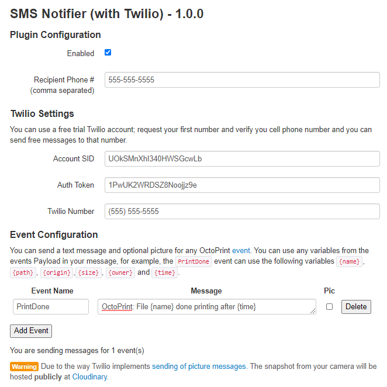

# OctoPrint-Twilio

Recieve SMS notifications when OctoPrint jobs are complete.

## Installation

Install via the OctoPrint [Plugin Manager](https://github.com/foosel/OctoPrint/wiki/Plugin:-Plugin-Manager) or manually using this [archive URL](https://github.com/taxilian/OctoPrint-Twilio/archive/master.zip):

	https://github.com/taxilian/OctoPrint-Twilio/archive/master.zip

## Configuration

You will need an active Twilio account.  A free account is fine, but you will only be able to send to your own (verified) phone number. Make sure you go to `Phone Numbers` -> `Manage Numbers` and get your Twilio phone number; this should be your "from" number.

## Acknowledgements

Loosely based on [OctoPrint-EmailNotifier](https://github.com/anoved/OctoPrint-EmailNotifier). 

Uses [twilio-python](https://github.com/twilio/twilio-python) to send sms messages and [phonenumbers](https://github.com/daviddrysdale/python-phonenumbers) to clean them up.

## License

Licensed under the terms of the [AGPLv3](http://opensource.org/licenses/AGPL-3.0).
